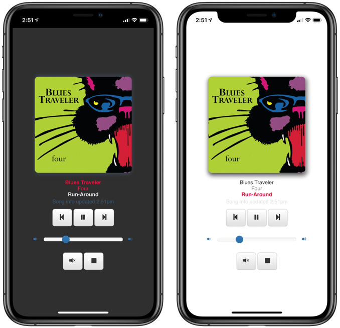

Utilities to display [`shairport-sync`](https://github.com/mikebrady/shairport-sync) metadata (via MQTT)[1](#f1)

See [REQUIREMENTS](REQUIREMENTS.md) for other things you'll need (like AirPlay source, AirPlay receiver such as `shairport-sync`, MQTT broker, and software or hardware renderers/displays).

A fork of [shairport-sync-mqtt-display](https://github.com/idcrook/shairport-sync-mqtt-display)

### Python app

In progress...

### Webserver webapp

[python-flask-socketio-server](python-flask-socketio-server/#readme) - [README.md](python-flask-socketio-server/README.md)

-	Displays currently playing track info, including cover art.
-	Configurable UI. Dark-mode support.
-	Support for mobile browsers. Webapp manifest.
-	Playback controls.

### LICENSE

Code and documentation Copyright © 2024 TechnoNene under [MIT License](LICENSE).

---

<i id="f1">1</i>: MQTT metadata support released in `shairport-sync` [Version 3.3](https://github.com/mikebrady/shairport-sync/releases/tag/3.3)[⤸](#a1)
