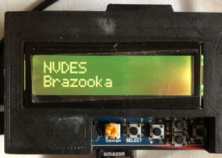

`circuitpython_char_lcd` works in conjunction with [`shairport-sync`](https://github.com/mikebrady/shairport-sync) + MQTT and an Adafruit<sup id="a1">[1](#f1)</sup> 16x2 Character LCD Display on a Raspberry Pi. It has remote-control support.

If you build [`shairport-sync`](https://github.com/mikebrady/shairport-sync) from source on your Raspberry Pi, you should be able to get this working.

Before we begin
===============

First, some requirements for your home network.

1.	*AirPlay®* source<sup id="a2">[2](#f2)</sup>

2.	*`shairport-sync`* as AirPlay® receiver

	-	`shairport-sync` needs to be built with *MQTT support*. See [wiki - Build shairport-sync](https://github.com/idcrook/shairport-sync-mqtt-display/wiki/Build-shairport-sync-with-MQTT-support)

3.	*MQTT broker*

	-	An MQTT broker, like `mosquitto`, visible on same network. See [wiki - Configure MQTT broker](https://github.com/idcrook/shairport-sync-mqtt-display/wiki/Configure-mosquitto-MQTT-broker)

4.	*Display*

	-	A Raspberry Pi for running the [CircuitPython](https://learn.adafruit.com/circuitpython-on-raspberrypi-linux/installing-circuitpython-on-raspberry-pi) script with a Character LCD display attached. A keypad for performing as a remote control is optional, but a nice feature.

Requirements 2., 3., and 4. can all be hosted on a single Raspberry Pi®

For app developement, Adafruit's [Adafruit RGB Negative 16x2 LCD+Keypad Kit for Raspberry Pi](https://www.adafruit.com/product/1110) LCD Pi Plate was used.

let's go
--------

For our purposes, this guide assumes a Raspberry Pi running Raspbian `buster` running on same Raspberry Pi where the display app runs.

See [wiki](https://github.com/idcrook/shairport-sync-mqtt-display/wiki) for additional pointers.

Quickstart
----------

Install python dependencies and clone this repo

```bash
# Install a python3 dev setup and other libraries
sudo apt install -y python3-pip python3-venv build-essential \
    python3-setuptools python3-wheel git mosquitto-clients

# grab a copy of this repo
git clone https://github.com/idcrook/shairport-sync-mqtt-display.git
cd shairport-sync-mqtt-display
# now proceed to the next section: "install"
```

install
-------

python3's `venv` module is used for maintaining our dependencies.

```bash
cd circuitpython_char_lcd/
python3 -m venv env
source env/bin/activate
pip install adafruit-circuitpython-charlcd
pip install paho-mqtt
pip install wheel # not required; avoids a pyyaml benign build error
pip install pyyaml

# required for backlight color analysis
pip install colorthief
sudo apt install libtiff5      # needed on stretch
sudo apt install libopenjp2-7  # needed on buster
```

config
------

Copy the example config file and customize.

```shell
cp config.example.yaml config.secrets.yaml
$EDITOR config.secrets.yaml # $EDITOR would be nano, vi, etc.
```

1.	Configure the MQTT section (`mqtt:`) to reflect your environment.

	-	For the `topic`, I use something like `shairport-sync/SSHOSTNAME`
		-	this `topic` needs to match the `mqtt.topic` string in your `/etc/shairport-sync.conf` file
		-	`SSHOSTNAME` is the name of where `shairport-sync` is running
		-	Note, there is **no** leading slash ('`/`') in the `topic` string
	-	Use the same mqtt broker for `host` that you did in your MQTT broker config testing and `shairport-sync.conf`

2.	Customize the UI and remote control sections if desired.

running
=======

Assumed music playing using AirPlay® (e.g. iTunes®), an MQTT broker, and `shairport-sync` with MQTT support are already online. Also assumes that `config.yaml` has been configured to match your home network environment.

```bash
# this is the python virtual environment we installed into
source env/bin/activate
python mqtt_lcd_display.py
# info should be displayed on the lcd
```

Automatically launch webserver on boot
--------------------------------------

There's a `systemd` service file at `circuitpython_char_lcd/etc/shairport-sync_charlcd.service` in this git repository.

The file's header includes instructions that can be used to install the python script as a `systemd` service. In this way, it will run automatically at boot-up. It will automatically serve metadata when `shairport-sync` configured for MQTT metadata is an AirPlay® target.

troubleshooting?
----------------

troubleshooting running
-----------------------

#### Name or service not known

If you get an error like

```
socket.gaierror: [Errno -2] Name or service not known
```

you should add the mqtt broker host that you are using to `/etc/hosts` on the computer that is hosting the webserver apple. For example, and entry like:

```
192.168.1.42 rpi
```

future ideas
============

Moved to [issues](https://github.com/idcrook/shairport-sync-mqtt-display/issues) and managed there.

inspired by
-----------

-	MQTT metadata support released in [`shairport-sync` 3.3](https://github.com/mikebrady/shairport-sync/releases/tag/3.3)

Development
-----------

`circuitpython_char_lcd` is a [CircuitPython](http://circuitpython.org) (via Blinka) script which uses [MQTT](https://www.eclipse.org/paho/clients/python/) to display [`shairport-sync`](https://github.com/mikebrady/shairport-sync)-provided metadata. It has remote-control support and works great with Apple Music®

Original development setup:

-	*iTunes®* and Airfoil Airplay-ing to Raspberry Pi(s).
-	Raspberry Pi Model 3 B
	-	running `mosquitto` MQTT broker
	-	running `shairport-sync`, configured with MQTT to send [cover artwork and parsed metadata](https://github.com/idcrook/shairport-sync-mqtt-display/wiki/Build-shairport-sync-with-MQTT-support#salient-pieces-of-a-working-config-file)
-	Raspberry Pi Model B with a 16x2 CharLCD and keypad

	-	yes, an "original" Model B which was first sold in 2012
	-	running `mqtt_lcd_display.py`
	-	deployed on a Raspberry Pi running Raspbian `buster`/`python3.7.3`
	-	Useful docs:
		-	[Character LCDs - Python & CircuitPython Usage](https://learn.adafruit.com/character-lcds/python-circuitpython#python-and-circuitpython-usage-7-12)
		-	[Adafruit 16x2 Character LCD + Keypad for Raspberry Pi - Python Usage](https://learn.adafruit.com/adafruit-16x2-character-lcd-plus-keypad-for-raspberry-pi/python-usage)

---

<i id="f1">1</i>: Trademarks are the respective property of their owners.[⤸](#a1)

<i id="f2">2</i>: This could be

-	iTunes® on a computer.
-	Music* app in iOS™.
-	Rogue Amoeba's [Airfoil](https://rogueamoeba.com/airfoil/) app

[⤸](#a2)
